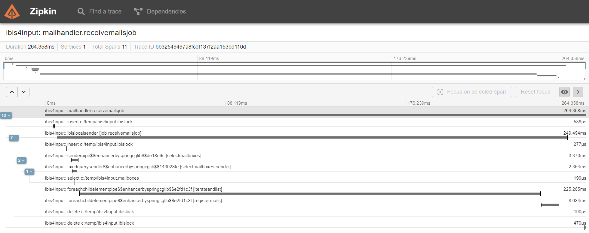
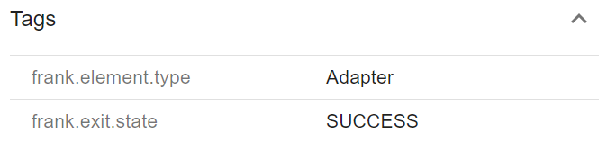
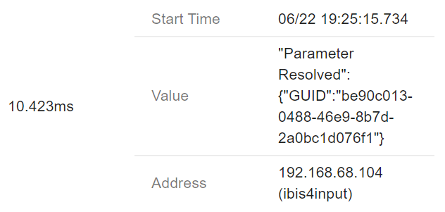

# Frank OTEL Instrumentation

Provides instrumentation modules for the [OpenTelemetry Agent](https://github.com/open-telemetry/opentelemetry-java-instrumentation) to instrument a [Frank Framework](https://github.com/ibissource/iaf) instance.

### Side Note
This project is still under heavy development and based on the 7.7.6 release of the Frank Framework. The highest priority is to provide correct traces at first, then look into supporting features of newer versions of the framework.

If you have any feedback, ideas or found any issues, please let us know by creating an issue.

# Demo

- Start Zipkin with the following command`docker run -d -p 9411:9411 openzipkin/zipkin`, open http://localhost:9411/zipkin/ to access the UI.
- Download the OpenTelemetry Agent to a common folder.
- Build Frank OTEL Instrumentation module and place .jar in a common folder.
- Add the following JVM arguments: `-javaagent:path/to/common-folder/opentelemetry-javaagent.jar -Dotel.traces.exporter=zipkin -Dotel.resource.attributes=service.name=Frank -Dotel.javaagent.extensions=path/to/common-folder/frank-otel-instrumentation-1.0-SNAPSHOT.jar`
- Start JVM, trigger some Adapters and check Zipkin!

# Configuration

The Frank OTEL Instrumentation modules provide the following configurable options:

### Enable/disable exit tags
If true, whenever an exit is taken, a tag will be added to the current span.

##### Property
- frank.instrumentation.exits=`true|false`
- default: `true`

##### Example Usage
To disable this feature, add the following JVM property:
- -Dfrank.instrumentation.exits=false

### Enable/disable parameter events
If true, whenever a parameter value is resolved, an event will be added to the current span.

##### Property
- frank.instrumentation.parameters=`true|false` 
- default: `true`

##### Example Usage
To disable this feature, add the following JVM property:
- -Dfrank.instrumentation.parameters=false

### Enable/disable IteratorPipe parallel context propagation
If true, context is propagated when an IteratorPipe is configured to work in parallel.

##### Property
- frank.instrumentation.parallel.iterator.propagation=`true|false`
- default: `true`

##### Example Usage
To disable this feature, add the following JVM property:
- -Dfrank.instrumentation.parallel.iterator.propagation=false

# Useful info

- https://github.com/open-telemetry/opentelemetry-java-instrumentation/blob/main/docs/contributing/writing-instrumentation-module.md#write-an-instrumentationmodule-step-by-step
- The OpenTelemetry Java agent loads Advice classes inside of its own isolated `AgentClassLoader`, but the Advice method bytecode is inlined into the instrumented application classes.
- Application classes do not have access to the `AgentClassLoader`.