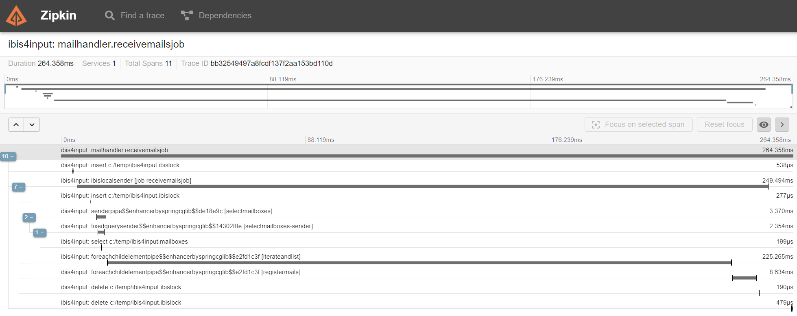
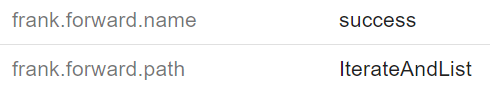
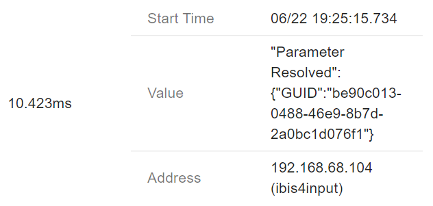

# Frank OTEL Instrumentation

Provides configurable instrumentation modules for the [OpenTelemetry Agent](https://github.com/open-telemetry/opentelemetry-java-instrumentation) to instrument a [Frank Framework](https://github.com/ibissource/iaf) instance.

The OpenTelemetry Agent instruments a lot of libaries and frameworks by default, this project aims to provide a production grade 'plug & play' module which helps to gain additional insights on the path a message took within a Frank application.

## Side Note
This project is still under heavy development and based on the 7.7.6 release of the Frank Framework. The highest priority is to provide correct traces at first, then look into supporting features of newer versions of the framework.

If you have any feedback, ideas or found any issues, please let us know by creating an issue.

# Table of contents
- [Demo](#demo)
- [Configuration](#configuration)
  * [Exit tags](#exit-tags)
  * [Forward tags](#forward-tags)
  * [Parameter events](#parameter-events)
  * [Pipe spans](#pipe-spans)
  * [Pipeline spans](#pipeline-spans)
  * [Sender spans](#sender-spans)
  * [IteratorPipe parallel context propagation](#iteratorpipe-parallel-context-propagation)
  * [Frank Framework API Tracing](#frank-framework-api-tracing)
- [Differences between Frank OTEL and Ladybug](#differences-between-frank-otel-and-ladybug)
  * [Tracing vs Debugging](#tracing-vs-debugging)
  * [Distributed vs Local](#distributed-vs-local)
  * [Trace Information vs Full Insights](#trace-information-vs-full-insights)
  * [Production ready](#production-ready)
- [Useful info](#useful-info)

  
# Demo

- Start Zipkin with the following command`docker run -d -p 9411:9411 openzipkin/zipkin`, open http://localhost:9411/zipkin/ to access the UI.
- Download the OpenTelemetry Agent to a common folder.
- Build Frank OTEL Instrumentation module and place .jar in a common folder.
- Add the following JVM arguments: `-javaagent:path/to/common-folder/opentelemetry-javaagent.jar -Dotel.traces.exporter=zipkin -Dotel.resource.attributes=service.name=Frank -Dotel.javaagent.extensions=path/to/common-folder/frank-otel-instrumentation-1.0-SNAPSHOT.jar`
- Start JVM, trigger some Adapters and check Zipkin!

# Configuration

The Frank OTEL Instrumentation modules provide the following configurable options:

## Exit tags
If true, whenever an exit is taken, a tag will be added to the current span.

### Property
- frank.instrumentation.exits=`true|false`
- default: `true`

### Example Usage
To disable this feature, add the following JVM property:
- -Dfrank.instrumentation.exits=false

## Forward tags
If true, whenever a forward is taken, a tag will be added to the current span.

### Property
- frank.instrumentation.forwards=`true|false`
- default: `true`

### Example Usage
To disable this feature, add the following JVM property:
- -Dfrank.instrumentation.forwards=false

## Parameter events
If true, whenever a parameter value is resolved, an event will be added to the current span.

### Property
- frank.instrumentation.parameters=`true|false` 
- default: `true`

### Example Usage
To disable this feature, add the following JVM property:
- -Dfrank.instrumentation.parameters=false

## Pipe spans
If true, whenever a pipe is called, a new span is created.

### Property
- frank.instrumentation.pipes=`true|false`
- default: `true`

### Example Usage
To disable this feature, add the following JVM property:
- -Dfrank.instrumentation.pipes=false

## Pipeline spans
If true, whenever a pipeline is called, a new span is created.

### Property
- frank.instrumentation.pipeline=`true|false`
- default: `true`

### Example Usage
To disable this feature, add the following JVM property:
- -Dfrank.instrumentation.pipeline=false

## Sender spans
If true, whenever a sender is called, a new span is created.

### Property
- frank.instrumentation.senders=`true|false`
- default: `true`

### Example Usage
To disable this feature, add the following JVM property:
- -Dfrank.instrumentation.senders=false

## IteratorPipe parallel context propagation
If true, context is propagated when an IteratorPipe is configured to work in parallel.

### Property
- frank.instrumentation.parallel.iterator.propagation=`true|false`
- default: `true`

### Example Usage
To disable this feature, add the following JVM property:
- -Dfrank.instrumentation.parallel.iterator.propagation=false

## Frank Framework API tracing
By default the OpenTelemetry agent also traces all traffic towards the Frank Framework API. It might be desired to disable tracing traffic towards these endpoints.

By activating the Frank Framework API sampler, all traffic towards configured endpoints will be ignored.

### Environment variable
Set the following environment variable to active the Frank Framework API Sampler
- OTEL_TRACES_SAMPLER=frank_framework_api_sampler

### Property
Override the following property to configure the list of endpoints that should be ignored.
- frank.sampler.ignore.http=`comma,separated,list`
- default: `/iaf/api,/iaf/gui,/testtool`

# Differences between Frank OTEL and Ladybug
There is a certain overlap of information which is captured, especially when the instrumentation modules are configured in the most verbose modes. 
There are certain differences between this project and the Ladybug project, the key differences are:

## Tracing vs Debugging
- Ladybug provides capabilities to debug and test the Frank application, i.e: inspect messages, compare reports, etc
- This project is meant to provide compatibility for the Frank Framework with the Open Telemetry standard, which aims to provide a vendor-neutral standard for tracing messages across distributed systems. 

## Distributed vs Local
- Ladybug is only capable of providing information of a single Frank instance.
- The OpenTelemetry standard is designed to provide information across distrubted systems.

## Trace Information vs Full Insights
- Ladybug provides full insights on how Frank components are configured, which sessionKeys are available within the session, it is inevitable that personal data is captured and visible for those with access to Ladybug.
- This project only traces the path a message took and aims to provide several configurable options which help to prevent capturing personal data.

## Production ready 
- Ladybug should not be used in production due a heavy impact on the memory of the JVM but also due to the verbosity of the information that is captured.
- The OpenTelemetry standard is designed to run in production systems and is used in production by sevaral organisations across the globe. 

# Useful info

- https://github.com/open-telemetry/opentelemetry-java-instrumentation/blob/main/docs/contributing/writing-instrumentation-module.md#write-an-instrumentationmodule-step-by-step
- The OpenTelemetry Java agent loads Advice classes inside of its own isolated `AgentClassLoader`, but the Advice method bytecode is inlined into the instrumented application classes.
- Application classes do not have access to the `AgentClassLoader`.
